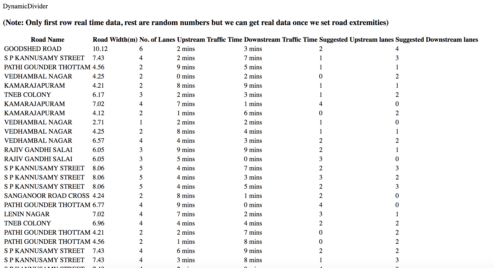

# Demo URL
https://dynamic-divier.herokuapp.com

#Instruction to run
  bundle
  rake db:create
  rake db:migrate
  # Start rails console and run following command to populate roads table with data
  Road.create_from_csv

## Start rails server
  rails s

